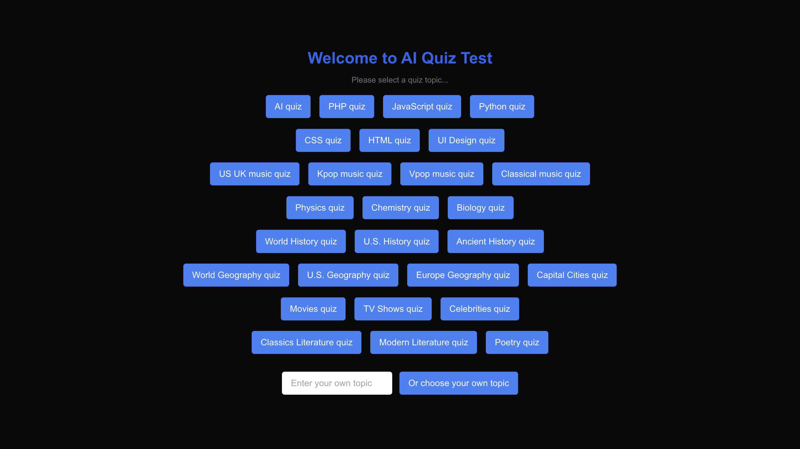
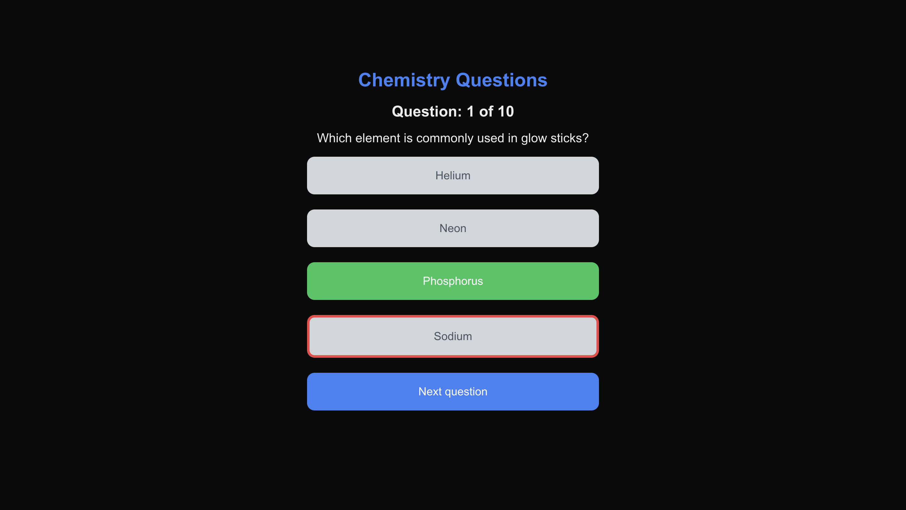

# AI Quiz App

This is an AI powered quiz app featuring NextJS Framework, Tailwind CSS and OpenAI
**[Go to live website](https://ai-quiz.alextran.dev)**

## Functions:
- Give a list of common quiz topics
- Input field so user can choose their own topic
- Give 10 random questions of the chosen topic with 4 options
- Provide answer after user chose an option
- Keep the score and display it after the test

## Technologies used

Languages:

- TypeScript

Libraries and frameworks:

- NextJS Typescript
- TailwindCSS
- OpenAI

## Setup and usage

**Live page [here](https://ai-quiz.alextran.dev)**

**To host project locally**
- Clone the project: 
```git clone https://github.com/alextrandev/AI-quiz-app.git```
- Change working directory ```cd AI-quiz-app```
- Install dependencies ```npm install```
- Serve project in local host ```npm run dev```


## Screenshot
**Homepage**


**Test page**


**Score page**


## Sources 

- [OpenAI Platform](https://platform.openai.com/)
- [Next.js Documentation](https://nextjs.org/docs) - learn about Next.js features and API.
- [Learn Next.js](https://nextjs.org/learn) - an interactive Next.js tutorial.
- [Tailwind CSS](https://tailwindcss.com)

## Authors and acknowledgment

- [Guide provided by Arindam Majumder](https://dev.to/latitude/building-an-ai-powered-quiz-application-with-nextjs-and-openai-2673?ref=dailydev)